# Amazon Elastic Kubernetes Service
Amazon Elastic Kubernetes Service (Amazon EKS) is a managed service that makes it easy for you to run Kubernetes on AWS without needing to stand up or maintain your own Kubernetes control plane. Amazon EKS runs Kubernetes control plane instances across multiple Availability Zones to ensure high availability. Amazon EKS automatically detects and replaces unhealthy control plane instances, and it provides automated version upgrades and patching for them.

Amazon EKS is also integrated with many AWS services to provide scalability and security for your applications, including the following:
* Amazon ECR for container images
* Elastic Load Balancing for load distribution
* IAM for authentication
* Amazon VPC for isolation

## How Does Amazon EKS Work?
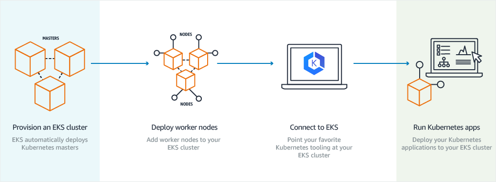
1. First, create an Amazon EKS cluster in the AWS Management Console or with the AWS CLI or one of the AWS SDKs.
2. Then, launch worker nodes that register with the Amazon EKS cluster. We provide you with an AWS CloudFormation template that automatically configures your nodes.
3. When your cluster is ready, you can configure your favorite Kubernetes tools (such as kubectl) to
communicate with your cluster.
4. Deploy and manage applications on your Amazon EKS cluster the same way that you would with any other Kubernetes environment.

## Client side-Amazon EKS Prerequisites
This section helps you to install and configure the binaries you need to create and manage an Amazon EKS cluster from local machine.
1. Install the Latest AWS CLI
2. Configure Your AWS CLI Credentials
3. Install and Configure kubectl for Amazon EKS

#### step 1: Install the Latest AWS CLI
To use kubectl with your Amazon EKS clusters, you must install a binary that can create the required client security token for cluster API server communication.

you can install the **AWS CLI** with the following command:
```bash
sudo pip install awscli --ignore-installed six
```
#### step 2: Configure Your AWS CLI Credentials
The AWS CLI require that you have AWS credentials configured in your environment.The **aws configure** command is the fastest way to set up your AWS CLI installation for general use.
```bash
$ aws configure
AWS Access Key ID [None]: **<Enter_your_access_key>**
AWS Secret Access Key [None]: **<Enter your secret key>**
Default region name [None]: **<Enter your region-code>**
Default output format [None]: json
```
#### step 3: Install and Configure kubectl for Amazon EKS
To use kubectl with your Amazon EKS clusters, you must install a binary that can create the required client security token for cluster API server communication.

you can install the **kubectl** with the following command:
```bash
curl -LO https://storage.googleapis.com/kubernetes-release/release/`curl -s https://storage.googleapis.com/kubernetes-release/release/stable.txt`/bin/linux/amd64/kubectl
chmod +x ./kubectl
sudo mv ./kubectl /usr/local/bin/kubectl
```
Confirm version installed
```bash
kubectl version -o json
```
## Amazon EKS Prerequisites
Before you can create an Amazon EKS cluster, you must configure steps, located in this below section
1. Create your Amazon EKS Service Role
2. Create your Amazon EKS Cluster VPC
#### step 1: Create your Amazon EKS Service Role
To create your Amazon EKS service role in the IAM console
1. Open the IAM console at https://console.aws.amazon.com/iam/
2. Choose Roles, then click Create role.
3. Choose EKS from the list of services, then EKS for your use case, and then Next: Permissions.
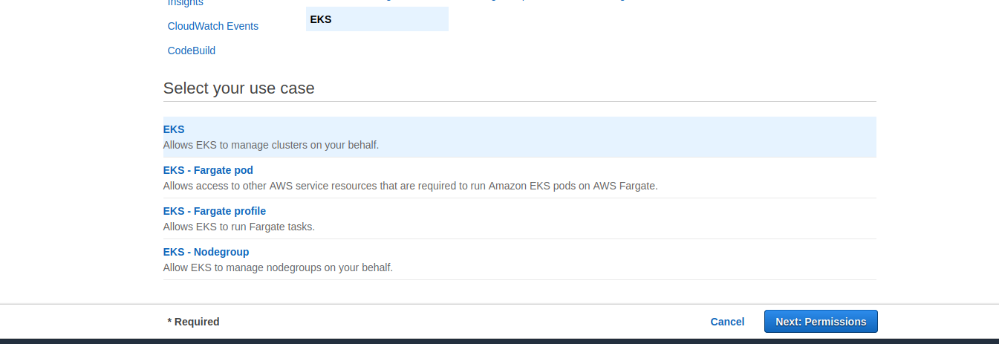
4. Choose Next: Tags.
5. Choose Next: Review
6. For Role name, enter a unique name for your role, such as **mlflow-eksServiceRole**, then choose Create role.
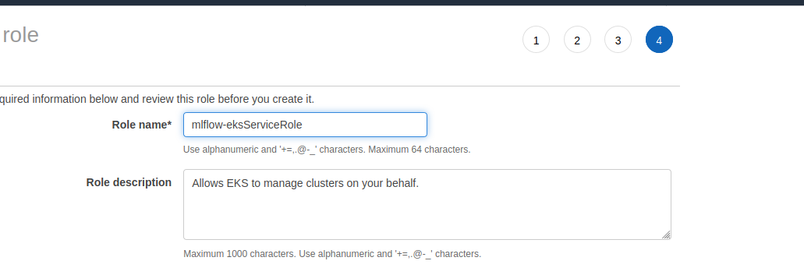

#### step 2: Create your Amazon EKS Cluster VPC
1. Open the AWS CloudFormation console at https://console.aws.amazon.com/cloudformation.
2. From the navigation bar, select a Region that supports Amazon EKS
3. Choose Create stack.
4. For Choose a template, select Specify an Amazon S3 template URL
5. Paste the following URL into the text area and choose Next:
```https://amazon-eks.s3-us-west-2.amazonaws.com/cloudformation/2019-11-15/amazon-eks-vpc-private-subnets.yaml```
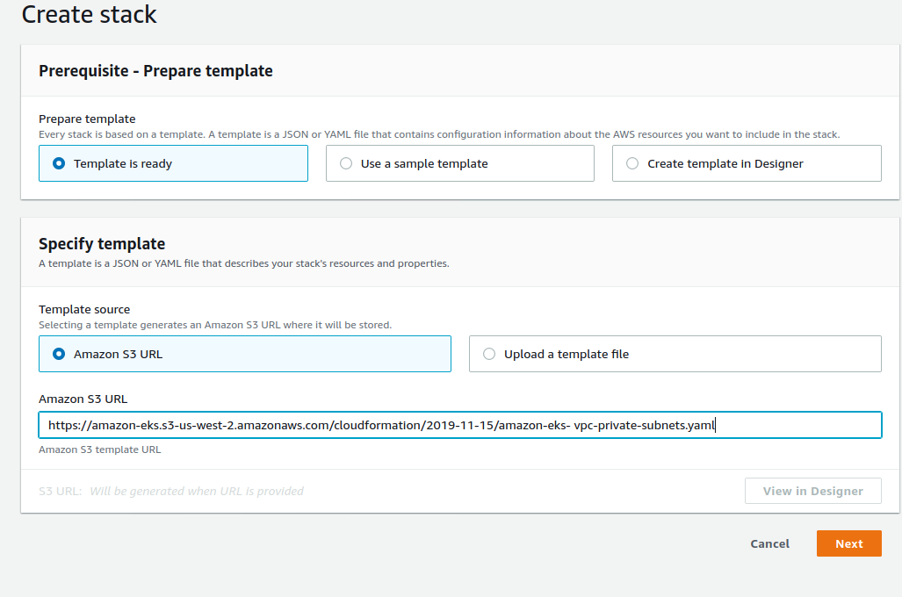
6. Choose a stack name for your AWS CloudFormation stack. For example, you can call it **mlflow-eks-stack**

7. (Optional) On the Options page, tag your stack resources. Choose Next
8. On the Review page, choose Create

## Creating an Amazon EKS Cluster
1. Open the Amazon EKS console at https://console.aws.amazon.com/eks/home#/clusters.
2. From the navigation bar, select a Region that supports Amazon EKS
3. Choose Create cluster
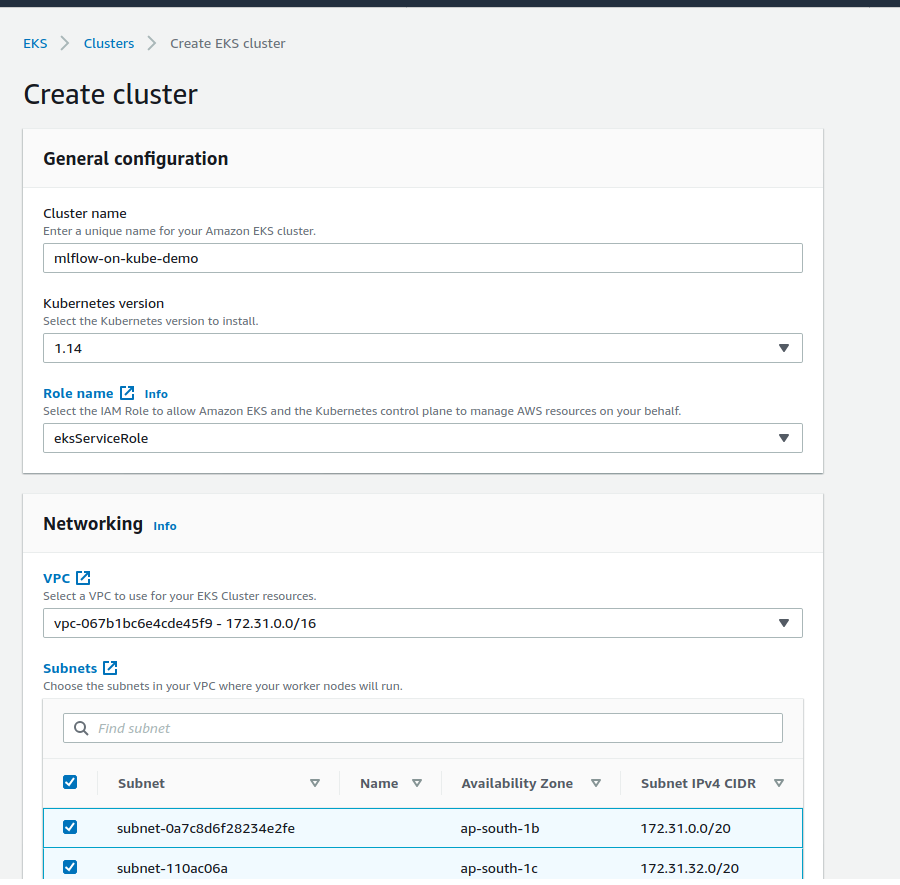
   
     * 3a. On the Create cluster page, fill in the following fields and then choose Create
     * 3b. select Kubernetes version
     * 3c. **Role name**--Choose the Amazon EKS service role to allow Amazon EKS and the Kubernetes control plane to manage AWS resources on your behalf.
     * 3d. **VPC**--The VPC to use for your cluster.
     * 3e. select the SecurityGroups value from the AWS CloudFormation output that you generated
        
4. The Status field shows CREATING until the cluster provisioning process completes. once it done cluster status became active.
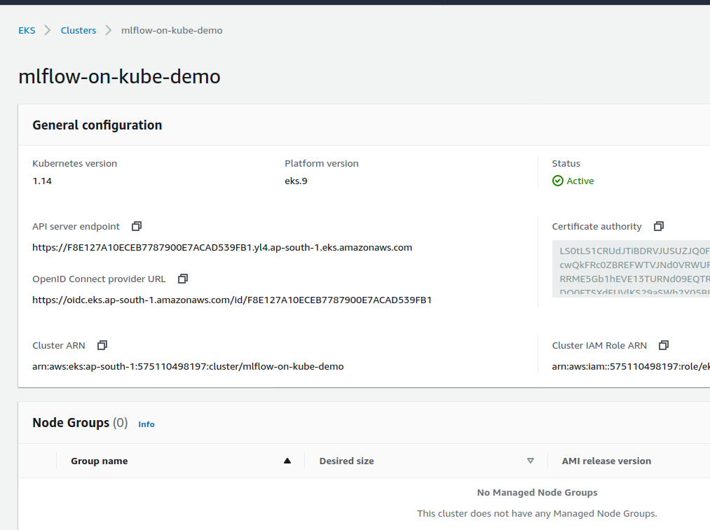
## Create a kubeconfig File
1. Ensure that you have at least version 1.18.10 of the AWS CLI installed
```bash
aws --version
```
2. Use the AWS CLI update-kubeconfig command to create or update your kubeconfig for your cluster.
```bash
aws eks --region **region-code** update-kubeconfig --name **cluster_name**
```
3. Test your configuration.
```bash
kubectl get svc
```
Output:
```
NAME         TYPE        CLUSTER-IP   EXTERNAL-IP   PORT(S)   AGE
kubernetes   ClusterIP   10.100.0.1   <none>        443/TCP   12m
```
## Launch a Managed Node Group
This section helps you to install and configure the binaries you need to create and manage an node group.
1. create your Amazon EKS worker node role in the IAM console
2. Creating a Key Pair Using Amazon EC2
3. To launch your managed node group

### step 1: create your Amazon EKS worker node role in the IAM console
1. Open the IAM console at https://console.aws.amazon.com/iam/.
2. Choose **Roles**, then Create role.
3. Choose **EC2** from the list of services, then Next: **Permissions**.

4. In the Filter policies box, enter **AmazonEKSWorkerNodePolicy**. Check the box to the left of AmazonEKSWorkerNodePolicy.
5. In the Filter policies box, enter **AmazonEKS_CNI_Policy**. Check the box to the left of AmazonEKS_CNI_Policy.
6. In the Filter policies box, enter **AmazonEC2ContainerRegistryReadOnly**. Check the box to the left of AmazonEC2ContainerRegistryReadOnly.
7. Choose Next: **Tags**.
8. (Optional) Add metadata to the role by attaching tags as key–value pairs. For more information about using tags in IAM, see Tagging IAM Entities in the IAM User Guide.
9. Choose Next: **Review**.
10. For Role name, enter a unique name for your role, such as **mlflow-eks-NodeInstanceRole**
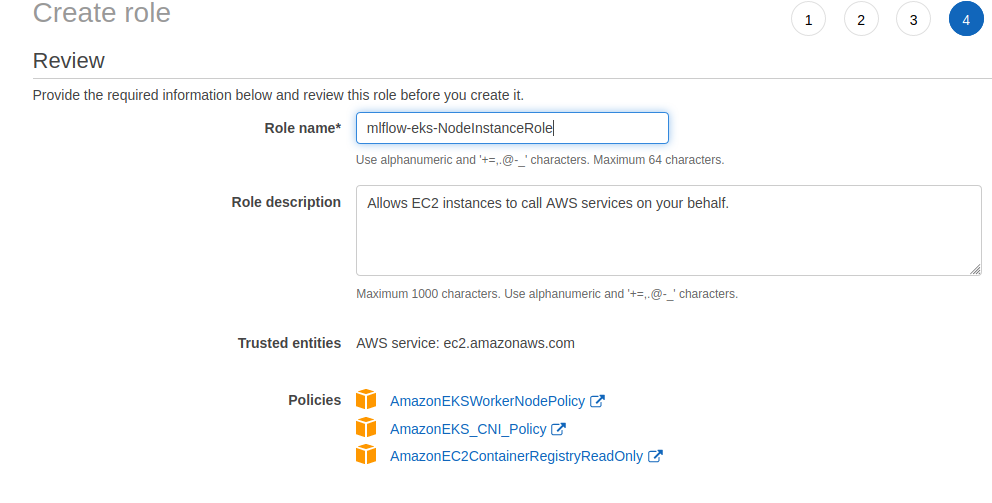
11. choose Create role

### step 2: Creating a Key Pair Using Amazon EC2
1. Open the Amazon EC2 console at https://console.aws.amazon.com/ec2/.
2. In the navigation pane, choose **Key Pairs**. 
3. Choose **Create key pair**.
4. For Name, enter a descriptive name for the key pair.
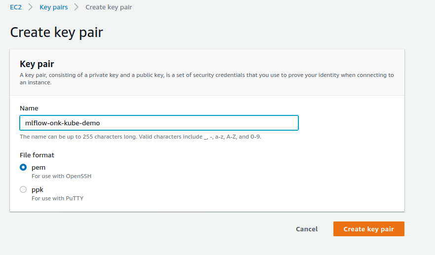
5. Choose **Create key pair**.  

### step 3: To launch your managed node group
1. Wait for your cluster status to show as **ACTIVE**. You cannot create a managed node group for a cluster that is not yet ACTIVE.
2. Open the Amazon EKS console at https://console.aws.amazon.com/eks/home#/clusters.
3. Choose the **name of the cluster** that you want to create your managed node group in.
4. On the **cluster page**, choose **Add node group**
5. On the **Configure node group page**, fill out the parameters accordingly, and then choose **Next**.
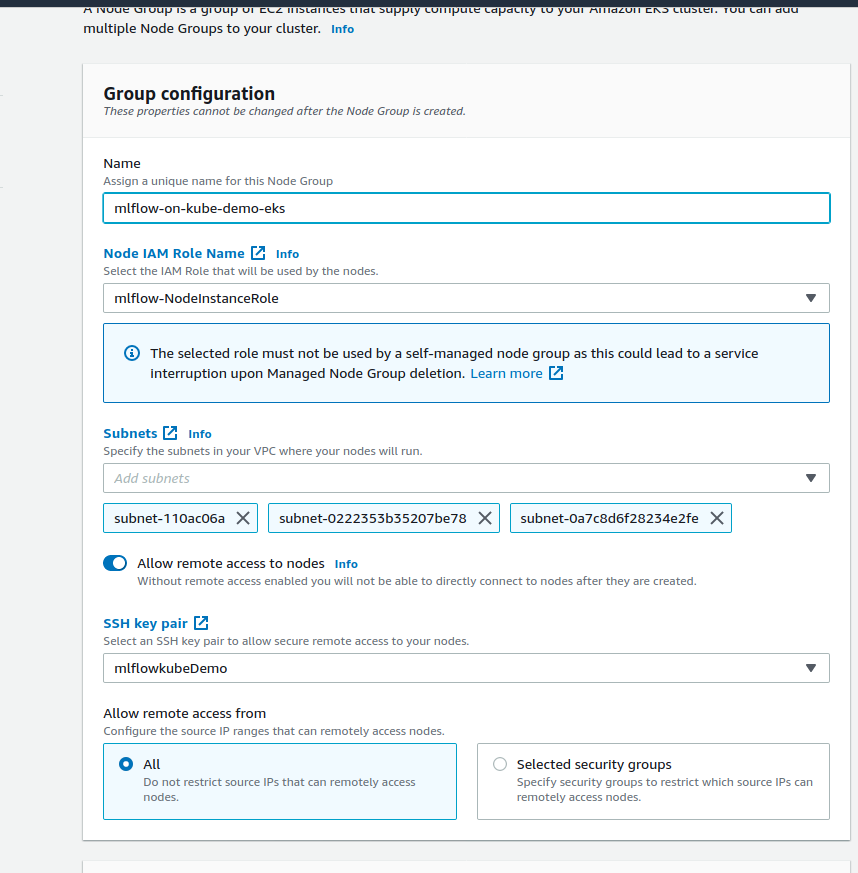
  * **Name** — Enter a unique name for your managed node group.
  * **Node IAM role name** — Choose the node instance role to use with your node group
  * **SSH key pair**--Choose the key pair
6. On the **Set compute configuration page**, fill out the parameters accordingly, and then choose **Next**.
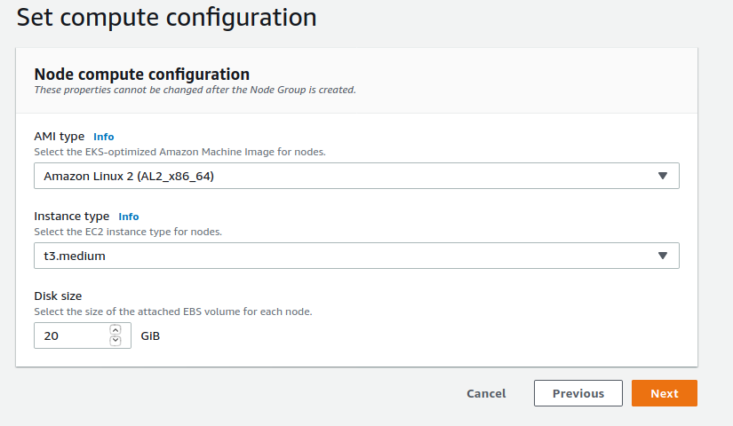
* **AMI type** — Choose Amazon Linux 2 (AL2_x86_64) for non-GPU instances, or Amazon Linux 2 GPU Enabled (AL2_x86_64_GPU) for GPU instances.
* **Instance type** — Choose the instance type to use in your managed node group. Larger instance types can accommodate more pods.
* **Disk size** — Enter the disk size (in GiB) to use for your worker node root volume
7. On the **Setup scaling policies page**, fill out the parameters accordingly, and then choose Next.
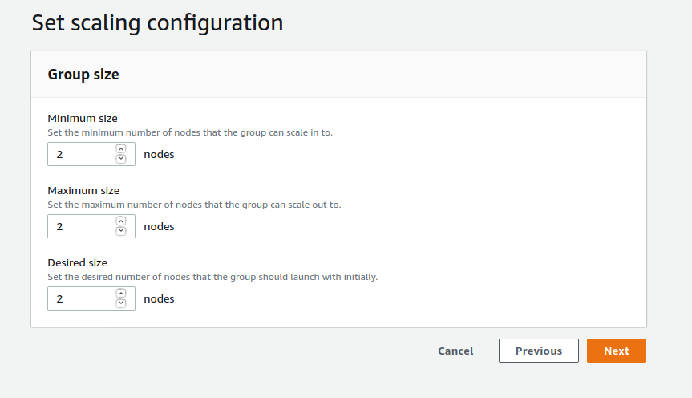
* **Minimum size** — Specify the minimum number of worker nodes that the managed node group can scale in to.
* **Maximum size** — Specify the maximum number of worker nodes that the managed node group can scale out to.
* **Desired size** — Specify the current number of worker nodes that the managed node group should maintain at launch.
8. On the **Review and create page**, review your managed node group configuration and choose Create.
9. Watch the status of your nodes
```bash
kubectl get nodes --watch
```
```bash
NAME                                           STATUS                        ROLES    AGE    VERSION
ip-172-31-19-18.ap-south-1.compute.internal    NotReady                      <none>   176m   v1.14.8-eks-b8860f
ip-172-31-32-169.ap-south-1.compute.internal   NotReady,SchedulingDisabled   <none>   176m   v1.14.8-eks-b8860f
ip-172-31-43-48.ap-south-1.compute.internal    Ready                         <none>   38s    v1.14.8-eks-b8860f
```
## Deploy the Kubernetes Web UI (Dashboard)
This section helps you to configure & Deploy the Kubernetes Web UI
1. Deploy the Kubernetes Metrics Server
2. Deploy the Dashboard
3. Create an eks-admin Service Account and Cluster Role Binding
4. Connect to the Dashboard

### step 1: Deploy the Kubernetes Metrics Server
1. Download and extract the latest version of the metrics server code from GitHub.
```bash
wget -O v0.3.6.tar.gz https://codeload.github.com/kubernetes-sigs/metrics-server/tar.gz/v0.3.6
```
Navigate to your downloads location and extract the source code archive
```bash
tar -xzf v0.3.6.tar.gz
```
2. Apply all of the YAML manifests in the metrics-server-0.3.6/deploy/1.8+ directory
```bash
kubectl apply -f metrics-server-0.3.6/deploy/1.8+/
```
3.Verify that the metrics-server deployment is running the desired number of pods with the following command
```bash
kubectl get deployment metrics-server -n kube-system
```
### step 2: Deploy the Dashboard
Use the following command to deploy the Kubernetes dashboard.
```bash
kubectl apply -f https://raw.githubusercontent.com/kubernetes/dashboard/v2.0.0-beta8/aio/deploy/recommended.yaml
```
output:
```
namespace/kubernetes-dashboard created
serviceaccount/kubernetes-dashboard created
service/kubernetes-dashboard created
secret/kubernetes-dashboard-certs created
secret/kubernetes-dashboard-csrf created
secret/kubernetes-dashboard-key-holder created
configmap/kubernetes-dashboard-settings created
role.rbac.authorization.k8s.io/kubernetes-dashboard created
clusterrole.rbac.authorization.k8s.io/kubernetes-dashboard created
rolebinding.rbac.authorization.k8s.io/kubernetes-dashboard created
clusterrolebinding.rbac.authorization.k8s.io/kubernetes-dashboard created
deployment.apps/kubernetes-dashboard created
service/dashboard-metrics-scraper created
deployment.apps/dashboard-metrics-scraper created
```
### step 3: Create an eks-admin Service Account and Cluster Role Binding
By default, the Kubernetes dashboard user has limited permissions. In this section, you create an eks-admin service account and cluster role binding that you can use to securely connect to the dashboard with admin-level permissions
1. Create a file called eks-admin-service-account.yaml with the text below. This manifest defines a service account and cluster role binding called eks-admin
```yaml
apiVersion: v1
kind: ServiceAccount
metadata:
   name: eks-admin
   namespace: kube-system
---
apiVersion: rbac.authorization.k8s.io/v1beta1
kind: ClusterRoleBinding
metadata:
   name: eks-admin
roleRef:
   apiGroup: rbac.authorization.k8s.io
   kind: ClusterRole
   name: cluster-admin
subjects:
-  kind: ServiceAccount
   name: eks-admin
   namespace: kube-system
```
2. Apply the service account and cluster role binding to your cluster
```bash
kubectl apply -f eks-admin-service-account.yaml
```
Output:
```
serviceaccount "eks-admin" created
clusterrolebinding.rbac.authorization.k8s.io "eks-admin" created
```
### step 4: Connect to the Dashboard
Now that the Kubernetes dashboard is deployed to your cluster, and you have an administrator service account that you can use to view and control your cluster, you can connect to the dashboard with that service account.

**To connect to the Kubernetes dashboard**
1. Retrieve an authentication token for the eks-admin service account. Copy the **<authentication_token>** value from the output. You use this token to connect to the dashboard.
```bash
kubectl -n kube-system describe secret $(kubectl -n kube-system get secret | grep eks-admin | awk '{print $1}')
```
2. Start the kubectl proxy.
```bash
kubectl proxy
```
3. To access the dashboard endpoint, open the following link with a web browser: 

http://localhost:8001/api/v1/namespaces/kubernetes-dashboard/services/https:kubernetes-dashboard:/proxy/#!/login.

4. Choose Token, paste the <authentication_token> output from the previous command into the Token field, and choose SIGN IN.
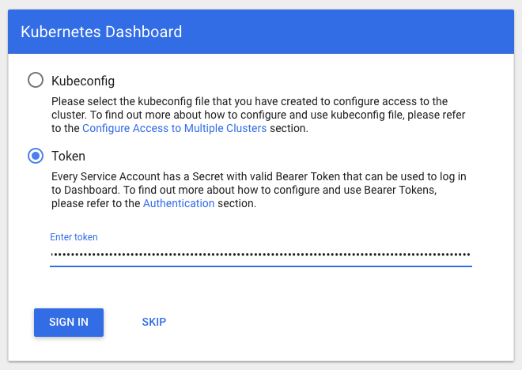

### Note: Push Docker image to Amazon ECR. please read this [DOC](doc/Steps-To-Push-An-Image-Into-Amazon-ECR-With-Docker.md)
